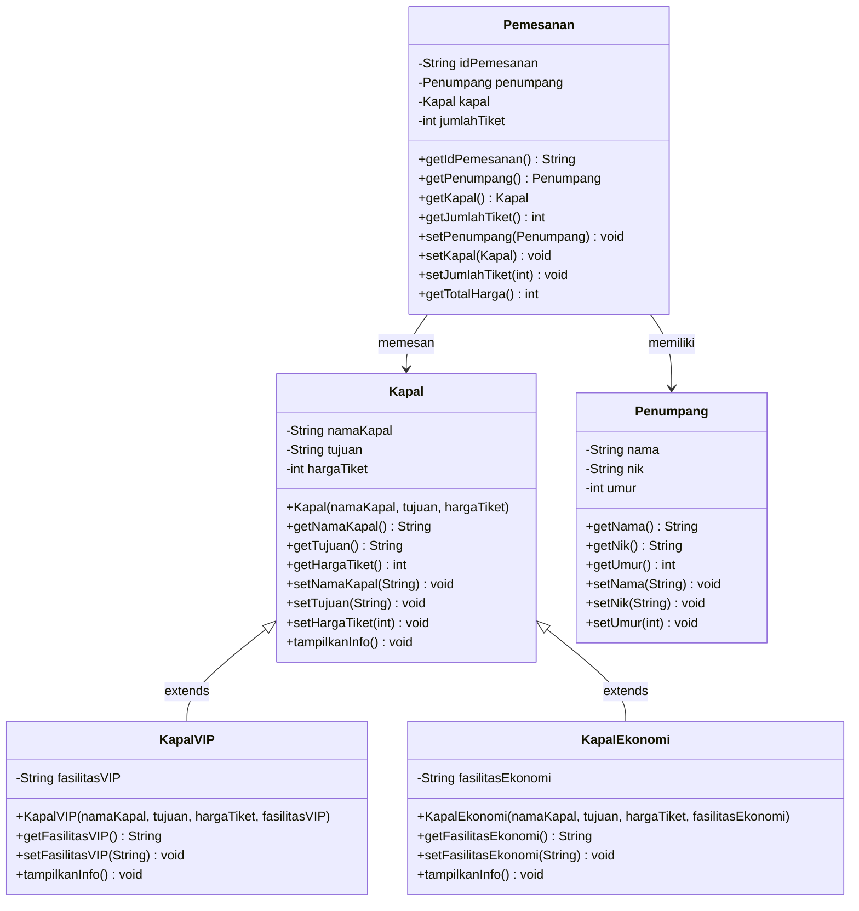

# Sistem Pemesanan Tiket Kapal

Aplikasi berbasis console (CLI) yang dibuat dengan Java untuk mengelola pemesanan tiket kapal. Proyek ini dibuat untuk mendemonstrasikan konsep **Object-Oriented Programming (OOP)**, khususnya **Inheritance**, **Encapsulation**, dan **Polymorphism (method overriding)**.

---

## 1. Identitas Mahasiswa

| Keterangan | Data |
|------------|------|
| **Nama**   | Rizki Adrianur Saputra |
| **NIM**    | 2509116049 |
| **Mata Kuliah** | PEMROGRAMAN BERORIENTASI OBJEK |

---

## 2. Studi Kasus

**Studi kasus: Sistem Pemesanan Tiket Kapal.**

Sebuah agen pelayaran membutuhkan aplikasi untuk mencatat pemesanan tiket kapal oleh penumpang. Setiap pemesanan berisi data penumpang, kapal yang dipilih, dan jumlah tiket. Kapal terbagi menjadi dua kelas dengan fasilitas berbeda:

- **Kapal VIP**: memiliki fasilitas VIP (contoh: kabin pribadi).
- **Kapal Ekonomi**: memiliki fasilitas ekonomi (contoh: kursi penumpang).

Keduanya memiliki atribut dasar yang sama (nama kapal, tujuan, harga tiket), sehingga dibuat superclass `Kapal` dan dua subclass yang mewarisinya. Inilah dasar penerapan **inheritance** pada proyek ini.

### Fitur Program (CRUD)

| Menu | Fungsi |
|------|--------|
| 1. Tambah Pemesanan | Menambah pemesanan baru (ID, data penumpang, pilihan kapal, jumlah tiket) dan menghitung total harga |
| 2. Tampilkan Pemesanan | Menampilkan seluruh data pemesanan beserta info kapal dan total harga |
| 3. Ubah Pemesanan | Mengubah data penumpang, kapal, dan jumlah tiket berdasarkan ID |
| 4. Hapus Pemesanan | Menghapus pemesanan berdasarkan ID dengan konfirmasi terlebih dahulu |
| 5. Keluar | Mengakhiri program |

### Validasi Input

- **ID Pemesanan**: tidak kosong, tepat 3 digit angka, dan harus unik.
- **Nama**: tidak kosong, hanya huruf dan spasi.
- **NIK**: tepat 16 digit angka.
- **Umur**: tidak kosong, angka, maksimal 3 digit, dan lebih dari 0.
- **Pilihan menu, kapal, dan jumlah tiket**: harus angka dan berada dalam rentang yang valid.

### Data Kapal yang Tersedia

| No | Nama Kapal | Tujuan | Kelas | Harga Tiket | Fasilitas |
|----|------------|--------|-------|-------------|-----------|
| 1 | KM Bukit Siguntang | Balikpapan | VIP (`KapalVIP`) | Rp150.000 | Kabin pribadi |
| 2 | KM Lambelu | Makassar | Ekonomi (`KapalEkonomi`) | Rp200.000 | Kursi penumpang |
| 3 | KM Dorolonda | Parepare | Ekonomi (`KapalEkonomi`) | Rp175.000 | Kursi penumpang |

---

## 3. Struktur Proyek

```
Sistem_pemesanan_tiket_Kapal/
├── pom.xml
└── src/
    └── main/
        └── java/
            ├── com/mycompany/sistem_pemesanan_tiket_kapal/
            │   └── Sistem_pemesanan_tiket_Kapal.java   # Class utama (main & menu)
            └── model/
                ├── Kapal.java            # Superclass
                ├── KapalVIP.java         # Subclass (extends Kapal)
                ├── KapalEkonomi.java     # Subclass (extends Kapal)
                ├── Penumpang.java        # Data penumpang
                └── Pemesanan.java        # Data pemesanan
```

---

## 4. Diagram Kelas dan Hierarki Class

### Hierarki Inheritance

```
            Kapal            <-- superclass (induk)
           /     \
          /       \
    KapalVIP   KapalEkonomi  <-- subclass (anak)
```

### Diagram Kelas (UML)



### Penjelasan Class

| Class | Peran | Keterangan |
|-------|-------|------------|
| `Kapal` | **Superclass** | Menyimpan atribut umum semua kapal: `namaKapal`, `tujuan`, `hargaTiket`, beserta getter, setter (dengan validasi), dan method `tampilkanInfo()`. |
| `KapalVIP` | **Subclass** dari `Kapal` | Menambah atribut `fasilitasVIP` dan meng-override `tampilkanInfo()`. |
| `KapalEkonomi` | **Subclass** dari `Kapal` | Menambah atribut `fasilitasEkonomi` dan meng-override `tampilkanInfo()`. |
| `Penumpang` | Class data | Menyimpan `nama`, `nik`, dan `umur` penumpang. |
| `Pemesanan` | Class transaksi | Menghubungkan `Penumpang` dan `Kapal`, menyimpan `jumlahTiket`, dan menghitung total harga lewat `getTotalHarga()`. |
| `Sistem_pemesanan_tiket_Kapal` | Class utama | Berisi `main()`, menu, dan penyimpanan data pemesanan dalam `ArrayList<Pemesanan>`. |

**Relasi antar class:**

- `KapalVIP` **is-a** `Kapal` dan `KapalEkonomi` **is-a** `Kapal` (inheritance).
- `Pemesanan` **has-a** `Penumpang` dan `Pemesanan` **has-a** `Kapal` (association). Karena tipe field-nya `Kapal`, sebuah pemesanan dapat berisi objek `KapalVIP` maupun `KapalEkonomi`.

---

## 5. Penjelasan Bagian Kode yang Menerapkan Inheritance

### a. Superclass `Kapal` (`model/Kapal.java`)

`Kapal` menampung atribut dan perilaku yang dimiliki semua jenis kapal.

```java
public class Kapal {

    private String namaKapal;
    private String tujuan;
    private int hargaTiket;

    public Kapal(String namaKapal, String tujuan, int hargaTiket) {
        this.namaKapal = namaKapal;
        this.tujuan = tujuan;
        this.hargaTiket = hargaTiket;
    }

    // getter & setter ...

    public void tampilkanInfo() {
        System.out.println("Nama Kapal  : " + namaKapal);
        System.out.println("Tujuan      : " + tujuan);
        System.out.println("Harga Tiket : Rp" + hargaTiket);
    }
}
```

### b. Subclass `KapalVIP` (`model/KapalVIP.java`)

```java
public class KapalVIP extends Kapal {                       // (1)

    private String fasilitasVIP;                            // (2)

    public KapalVIP(String namaKapal, String tujuan, int hargaTiket,
            String fasilitasVIP) {

        super(namaKapal, tujuan, hargaTiket);               // (3)
        setFasilitasVIP(fasilitasVIP);
    }

    public void tampilkanInfo() {                           // (4)
        System.out.println("Nama Kapal     : " + getNamaKapal());
        System.out.println("Tujuan         : " + getTujuan());
        System.out.println("Harga Tiket    : Rp" + getHargaTiket());
        System.out.println("Fasilitas VIP  : " + fasilitasVIP);
    }
}
```

| No | Bagian kode | Penjelasan |
|----|-------------|------------|
| (1) | `extends Kapal` | Menyatakan `KapalVIP` mewarisi seluruh atribut dan method non-private dari `Kapal`. |
| (2) | `private String fasilitasVIP` | Atribut tambahan yang hanya dimiliki `KapalVIP` (spesialisasi). |
| (3) | `super(namaKapal, tujuan, hargaTiket)` | Memanggil constructor superclass agar atribut warisan (`namaKapal`, `tujuan`, `hargaTiket`) diinisialisasi. Tidak perlu menulis ulang atribut tersebut. |
| (4) | `tampilkanInfo()` | **Method overriding**: menimpa `tampilkanInfo()` milik `Kapal` agar juga menampilkan fasilitas VIP. Karena atribut milik `Kapal` bersifat `private`, subclass mengaksesnya lewat getter (`getNamaKapal()`, `getTujuan()`, `getHargaTiket()`). |

### c. Subclass `KapalEkonomi` (`model/KapalEkonomi.java`)

Menggunakan pola yang sama dengan `KapalVIP`: `extends Kapal`, memanggil `super(...)`, menambah atribut `fasilitasEkonomi`, dan meng-override `tampilkanInfo()`.

```java
public class KapalEkonomi extends Kapal {

    private String fasilitasEkonomi;

    public KapalEkonomi(String namaKapal, String tujuan, int hargaTiket,
            String fasilitasEkonomi) {

        super(namaKapal, tujuan, hargaTiket);
        setFasilitasEkonomi(fasilitasEkonomi);
    }

    public void tampilkanInfo() {
        System.out.println("Nama Kapal        : " + getNamaKapal());
        System.out.println("Tujuan            : " + getTujuan());
        System.out.println("Harga Tiket       : Rp" + getHargaTiket());
        System.out.println("Fasilitas Ekonomi : " + fasilitasEkonomi);
    }
}
```

### d. Pemanfaatan Inheritance di Class Utama

**Objek subclass disimpan pada variabel bertipe superclass** (`Sistem_pemesanan_tiket_Kapal.java`):

```java
Kapal kapal1 = new KapalVIP("KM Bukit Siguntang", "Balikpapan", 150000, "Kabin pribadi");
Kapal kapal2 = new KapalEkonomi("KM Lambelu", "Makassar", 200000, "Kursi penumpang");
```

**Polymorphism saat menampilkan data** (menu 2):

```java
p.getKapal().tampilkanInfo();
```

`p.getKapal()` bertipe `Kapal`, tetapi objek aslinya bisa `KapalVIP` atau `KapalEkonomi`. Java secara otomatis memanggil versi `tampilkanInfo()` yang sesuai dengan jenis objek sebenarnya (baris "Fasilitas VIP" atau "Fasilitas Ekonomi" akan muncul sesuai kapal yang dipesan).

**Class `Pemesanan` cukup bergantung pada `Kapal`** (`model/Pemesanan.java`):

```java
private Kapal kapal;

public int getTotalHarga() {
    return kapal.getHargaTiket() * jumlahTiket;
}
```

Perhitungan total harga bekerja untuk semua jenis kapal tanpa perlu mengetahui apakah kapalnya VIP atau Ekonomi. Jika kelak ditambah kelas baru (misalnya `KapalBisnis extends Kapal`), class `Pemesanan` tidak perlu diubah.

### Manfaat Inheritance pada Proyek Ini

1. **Reusability**: atribut dan method umum kapal cukup ditulis sekali di `Kapal`.
2. **Extensibility**: jenis kapal baru mudah ditambahkan dengan membuat subclass baru.
3. **Polymorphism**: satu pemanggilan `tampilkanInfo()` menghasilkan tampilan yang berbeda sesuai jenis kapal.
4. **Maintainability**: perubahan pada atribut umum (misalnya validasi harga) cukup dilakukan di satu tempat.

---

## 6. Cara Menjalankan Program

### Prasyarat

- **JDK** sesuai konfigurasi `pom.xml` (`maven.compiler.release` = `26`). Jika memakai versi JDK lain, sesuaikan nilai tersebut.
- **Apache Maven** (atau jalankan langsung lewat NetBeans).

### Opsi A: Melalui NetBeans

1. Buka project `Sistem_pemesanan_tiket_Kapal` di NetBeans.
2. Klik kanan pada project, lalu pilih **Run**.

### Opsi B: Melalui Maven (terminal)

```bash
mvn compile exec:java
```

### Opsi C: Kompilasi manual dengan `javac`

```bash
# dari folder root project
mkdir -p out
javac -d out src/main/java/model/*.java src/main/java/com/mycompany/sistem_pemesanan_tiket_kapal/*.java
java -cp out com.mycompany.sistem_pemesanan_tiket_kapal.Sistem_pemesanan_tiket_Kapal
```

---

## 7. Screenshot Program

### 7.1 Menu Utama

Menampilkan menu utama program yang berisi pilihan menu untuk menambah, menampilkan, mengubah, menghapus pemesanan, validasi input, dan keluar dari program.


### 7.2 Tambah Pemesanan (Menu 1)

Menampilkan proses penambahan data pemesanan tiket kapal melalui Menu 1.


### 7.3 Tampilkan Pemesanan (Menu 2)

Menampilkan data pemesanan yang telah berhasil ditambahkan melalui Menu 2.


### 7.4 Ubah Pemesanan (Menu 3)

Menampilkan proses perubahan data pemesanan melalui Menu 3.


**Bukti data berhasil diubah:**


### 7.5 Hapus Pemesanan (Menu 4)

Menampilkan proses penghapusan data pemesanan melalui Menu 4.


**Bukti data berhasil dihapus:**


### 7.6 Keluar Dari Pemerograman (Menu 5)

Menampilkan proses validasi input serta penggunaan Menu 5 untuk keluar dari program.


## 8. Teknologi yang Digunakan

- Bahasa pemrograman: **Java**
- Build tool: **Apache Maven**
- IDE: **Apache NetBeans**
- Struktur data: `ArrayList<Pemesanan>`

---

<p align="center">
  <b>[ISI NAMA LENGKAP]</b> &mdash; <b>[ISI NIM]</b>
</p>
